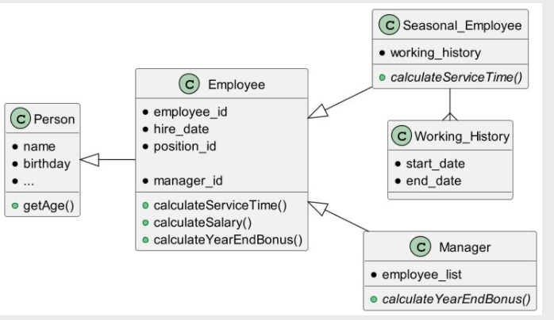

There is **Person** – identified by name, having birthday and other demographic information.

**Employee** – the Person, hired to the company, to specific department and position.

Methods:
 - `calculateServiceTime(asOfDate)`: number of full months the Employee is working in the company.
 - `calculateMonthSalary(asOfDate)`: position -> rate -> salary
 - `calculateYearEndBonus(asOfDate)`: position -> rate * serviceTime

**Seasonal** employees are hired temporary and re-hired again when additional
activity required.
The overridden method `calculateServiceTime()` is calculated as sum of the working periods.
Manager is Employee who has list of subordinate Employees. End of year bonus is augmented by sum of the managed 
employees’ bonuses.

**Task:** Need to calculate insurance, the value is calculated for regular employees based on position and age. Seasonal
employees not covered by insurance. Need to introduce method `calculateInsurance()`, but for Employee and Manager classes
only, not for Seasonal_Employee.

